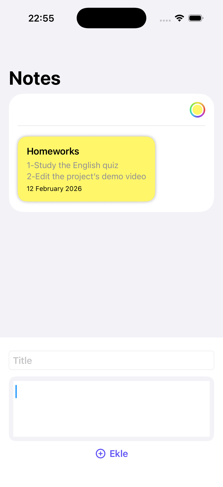
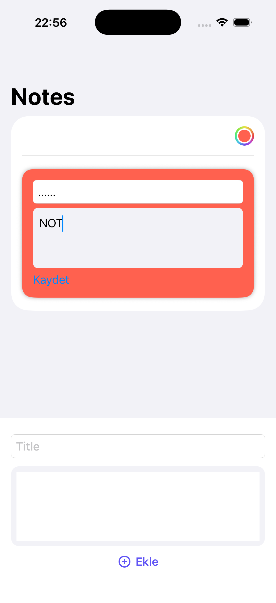
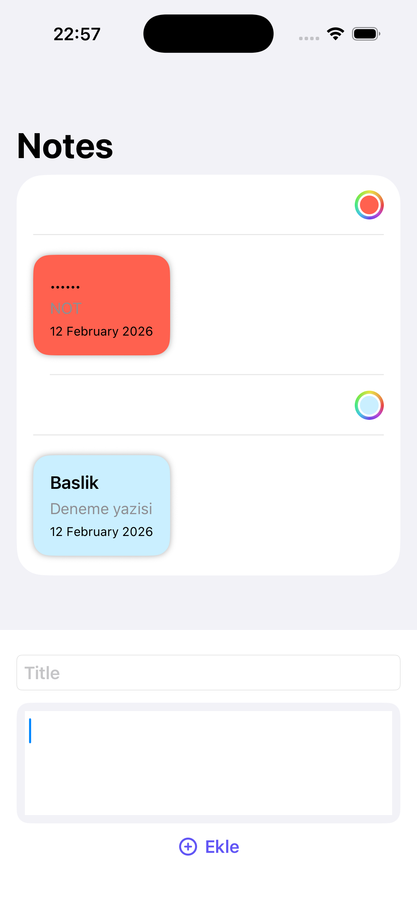
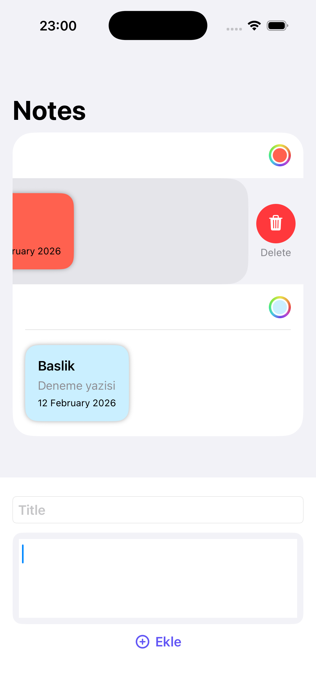
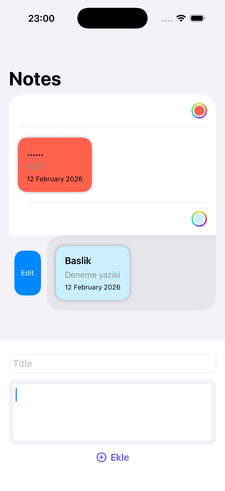

📝 Notes App (SwiftUI)

Bu proje, SwiftUI kullanılarak geliştirilmiş basit ve kullanıcı dostu bir not uygulamasıdır.
Kullanıcılar not ekleyebilir, düzenleyebilir, silebilir ve her nota ayrı renk atayabilir.

Amaç:
👉 SwiftUI öğrenirken MVVM mimarisini uygulamak
👉 State yönetimini ve kullanıcı etkileşimini anlamak
👉 Temiz ve sürdürülebilir kod yazmayı öğrenmek

✨ Özellikler
➕ Yeni not ekleme (başlık + içerik)
✏️ Not düzenleme (sadece seçilen not düzenlenir)
🗑️ Not silme (kaydırarak silme)
🎨 Her nota özel renk seçme (ColorPicker)
💾 Notlar kalıcı olarak saklanır (local storage)
📅 Tarih bilgisi gösterimi
📱 Modern SwiftUI arayüzü (kart tasarımı)

🛠️ Kullanılan Teknolojiler
Swift
SwiftUI
MVVM (Model - View - ViewModel) mimarisi
UserDefaults / Local Storage (notları saklamak için)
NavigationStack & List
SwipeActions
ColorPicker

## 📸 Uygulama Görselleri

  
  
  
  
  

